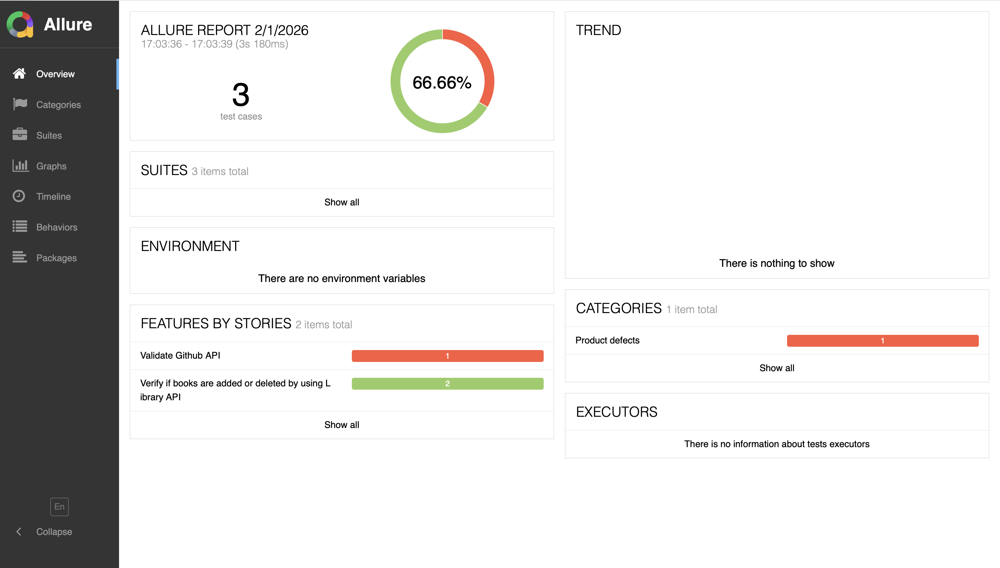
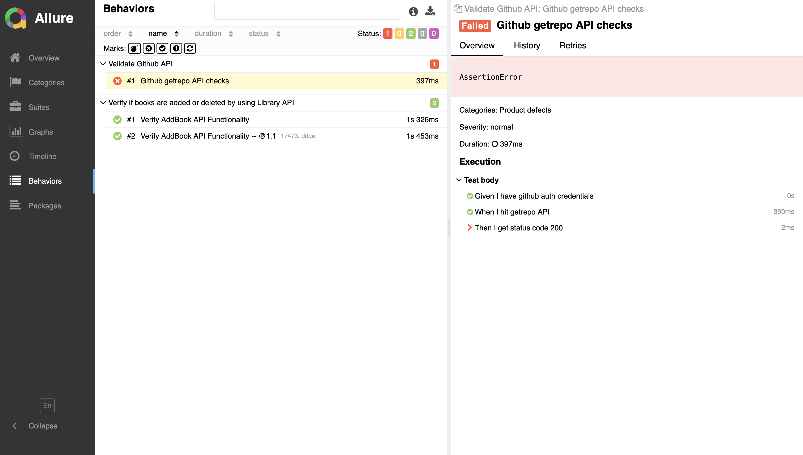

# Backend API Automation BDD Testing Framework

This project is a BDD (Behavior Driven Development) based API automation testing framework focusing on Mock Library Management.

---

## Tech Stack

* **Language:** Python 3.14
* **Testing Framework:** Behave (Gherkin)
* **API Library:** Requests
* **Reporting:** Allure Reports
* **Design Pattern:** Layered Architecture

---

## Project Structure

* **features/:** Gherkin feature files with test scenarios.
* **features/steps/:** Python step definitions for API logic.
* **payLoad.py:** Dynamic JSON payload generators.
* **utilities/:** Config reader and Centralized API resource paths.
* **environment.py:** Hooks for automated cleanup (Post-test data deletion).

---

## Key Features

* **Library API Testing**
* **Scenario Outline:** Implemented data-driven testing using ISBN and Aisle parameters.
* **Context Sharing:** Captures bookId from responses to share data between steps.
* **Automated Teardown:** Automatically deletes test books via after_scenario hook.
* **Session Management:** Uses requests.Session() for persistent authentication.
* **Secure Auth:** Implements Basic Auth using credentials managed via utility classes.

---

## Allure Reporting

